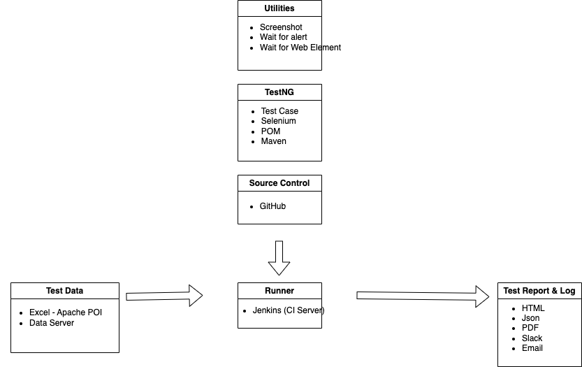

# End2End-Testing-Tools

- [TestNG](https://testng.org/)
- [Test Cafe](https://testcafe.io/)
- [Night Watch](https://nightwatchjs.org/)
- [Cypress](https://www.cypress.io/)

# End2End-Testing-Frameworks
- OpenSource Framework:
  - [Serenity BDD](https://serenity-bdd.info/)
  - [Katalium](https://katalon.com/)
  - [Selenide](https://selenide.org/)
- Custom Framework:
  - Java-Based

